<p align="center">
  
</p>

<h1 align="center">Cinder</h1>

<p align="center">
  A non-custodial desktop Solana wallet built with Qt and C++.
  <br />
  Send, swap, stake, and manage SPL tokens — with hardware wallet support, a built-in terminal, and an MCP server for AI agents.
</p>

<p align="center">
  <a href="https://cinderwallet.io">Website</a> · <a href="https://cinderwallet.io/docs">Documentation</a>
</p>

<p align="center">
  
  
  
  
</p>

---

<table align="center">
  <tr>
    <td>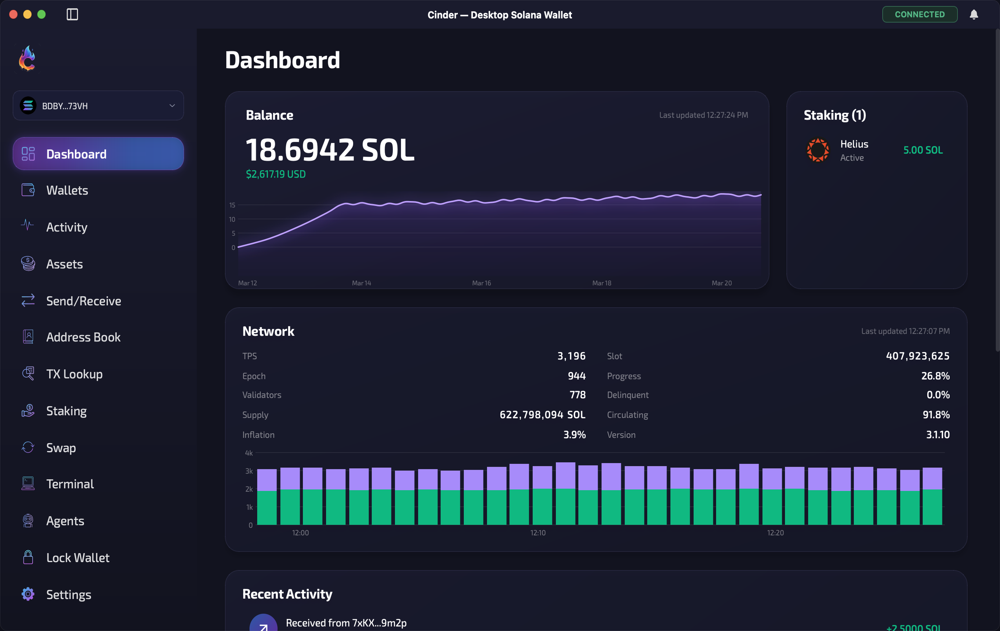</td>
    <td>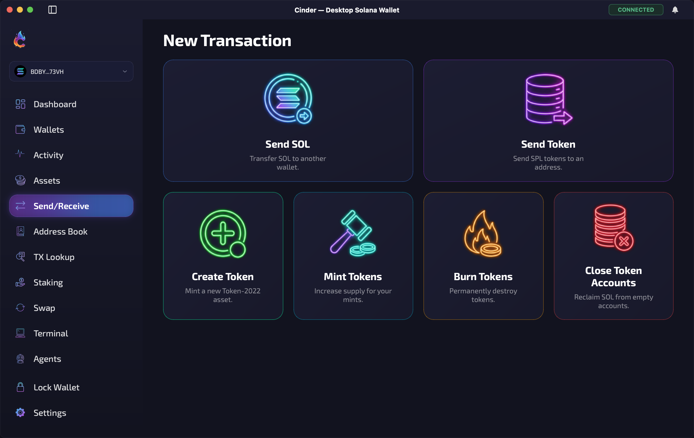</td>
    <td>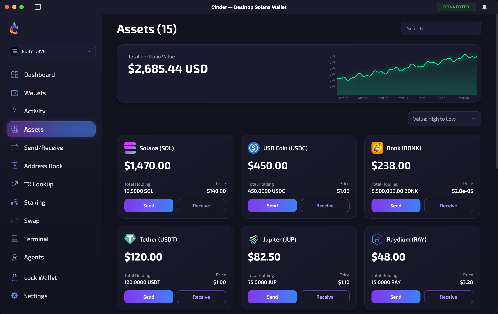</td>
  </tr>
  <tr>
    <td>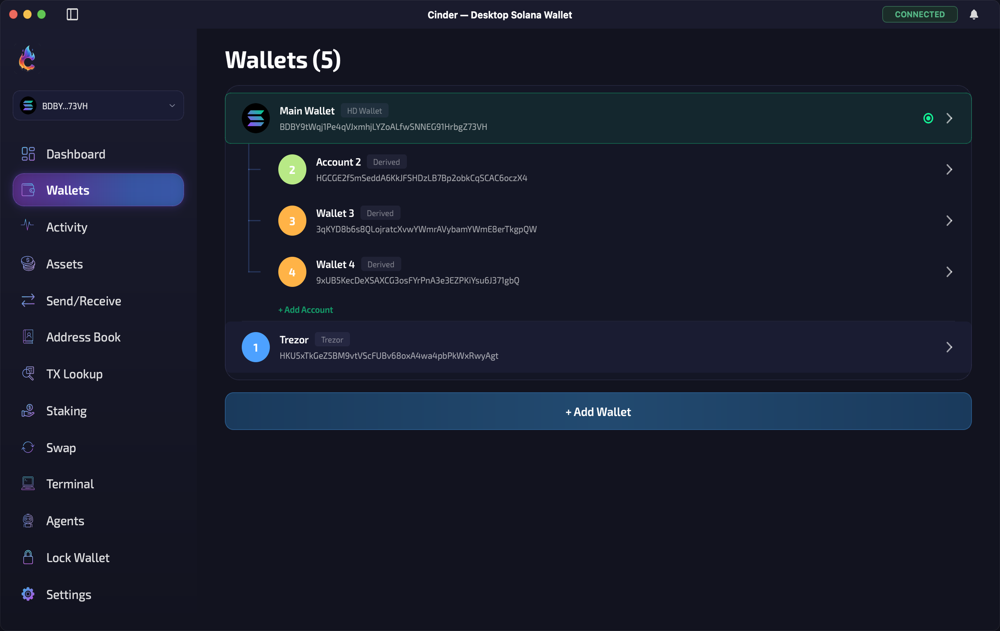</td>
    <td>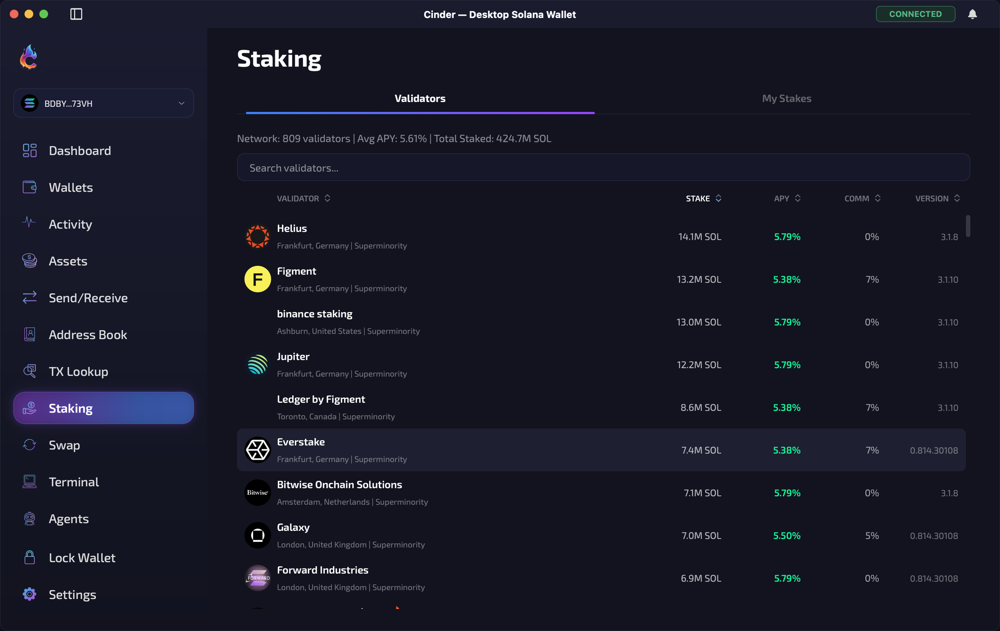</td>
    <td>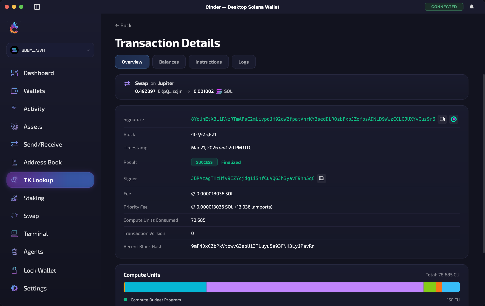</td>
  </tr>
  <tr>
    <td>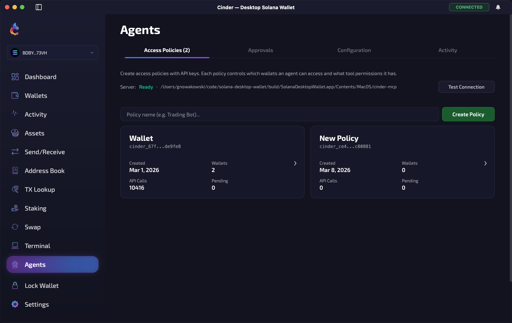</td>
    <td>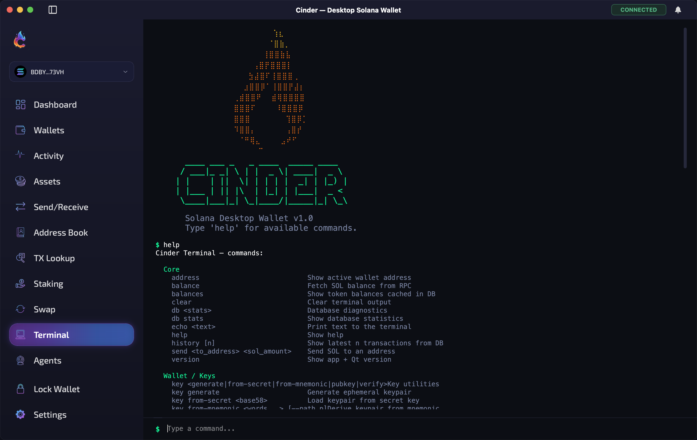</td>
    <td>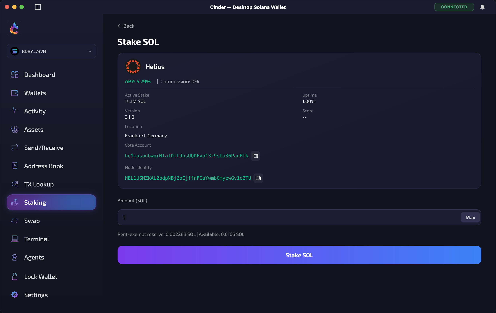</td>
  </tr>
  <tr>
    <td>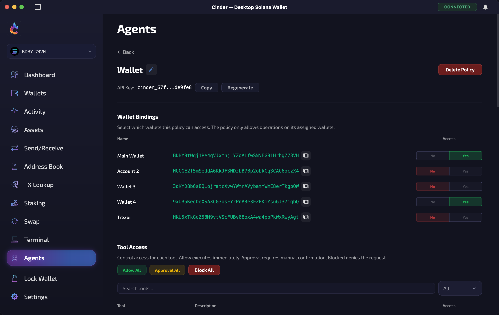</td>
    <td>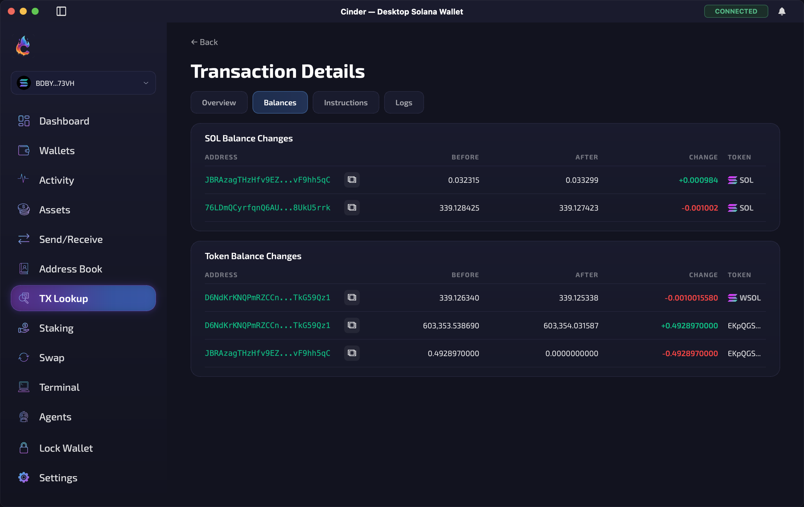</td>
    <td>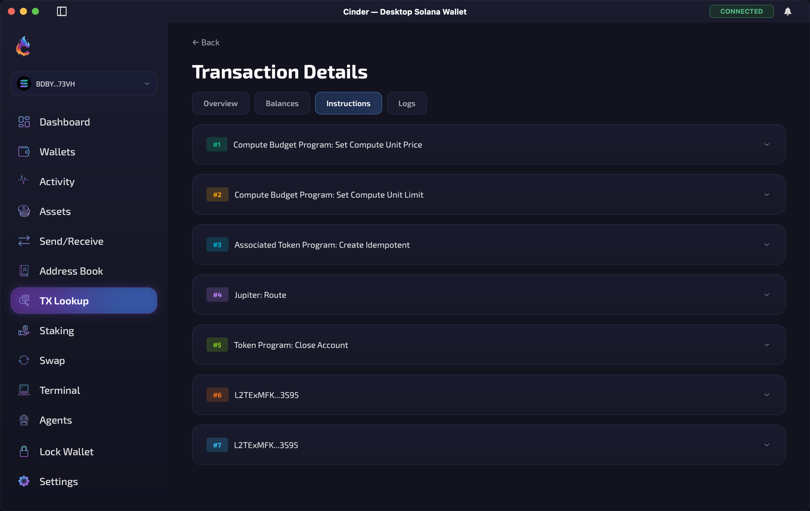</td>
  </tr>
</table>

## Features


**Wallet**

- Send/receive SOL and SPL tokens (including Token-2022)
- Swap via Jupiter DEX aggregation with slippage controls
- Stake SOL — browse validators, delegate, withdraw
- Create, mint, and burn Token-2022 tokens with extensions
- Durable nonce support
- Biometric unlock (Touch ID) 

**AI Agents (MCP)**

- Model Context Protocol server with 60+ tools
- Read-only tools (balances, history, quotes) run without approval
- Fund-moving tools require explicit UI approval
- Policy-based access control per wallet
- Works with Claude, Claude Code, and Codex

**Hardware Wallets**

- Ledger (Nano S / X / S+)
- Trezor (Model T / Safe 3 / One)
- GridPlus Lattice1

**Misc**

- Address book
- Transaction explorer — decode instructions, balances, compute units, logs
- Built-in terminal with 40+ commands

## Tech Stack

| Layer    | Technology                                       |
| -------- | ------------------------------------------------ |
| UI       | Qt 6 Widgets, Qt Charts                          |
| Language | C++20                                            |
| Build    | CMake 3.16+                                      |
| Crypto   | libsodium (Ed25519, Argon2id, XSalsa20-Poly1305) |
| Database | SQLite (Qt Sql) with versioned migrations        |
| RPC      | Qt Network — Solana JSON-RPC, Jupiter API        |
| Hardware | HIDAPI, libusb-1.0                               |
| QR Codes | libqrencode                                      |
| macOS    | Cocoa, LocalAuthentication, Security frameworks  |
| Website  | React, TypeScript, Vite, Cloudflare Pages        |

## Building

### Prerequisites

- CMake 3.16+
- C++20 compiler
- Qt 6.x (Widgets, Charts, Network, Sql, Concurrent, Svg)
- libsodium
- libqrencode

### macOS

```bash
brew install qt@6 libsodium qrencode hidapi libusb

mkdir build && cd build
cmake ..
cmake --build .

# Run
open Cinder.app
```

### Linux (Ubuntu/Debian)

```bash
sudo apt install qt6-base-dev qt6-charts-dev libsodium-dev libqrencode-dev \
                 libhidapi-dev libusb-1.0-0-dev cmake build-essential

mkdir build && cd build
cmake ..
cmake --build .

./Cinder
```

### Windows

1. Install [Qt 6](https://www.qt.io/download), [CMake](https://cmake.org/download/), and Visual Studio 2019+
2. Install vcpkg dependencies: `libsodium`, `qrencode`, `hidapi`, `libusb`

```bash
mkdir build && cd build
cmake -DCMAKE_PREFIX_PATH="C:/Qt/6.x/msvc2019_64" ..
cmake --build . --config Release
```

### Development rebuild

```bash
# Kills any running instance, rebuilds the app target only, and launches
bash build-and-run.sh

# If you intentionally want to rebuild tests and other targets too
bash build-and-run.sh --all-targets
```

## Security

- **Non-custodial** — private keys never leave your machine
- **Encrypted storage** — Argon2id key derivation, XSalsa20-Poly1305 authenticated encryption
- **Hardware wallet signing** — transactions signed on-device
- **Biometric unlock** — macOS Touch ID with Keychain integration

## License

[MIT](LICENSE)
